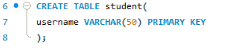

## FINAL TASK 2: Transforming ER intop Relational Table

For this task, we are given ER diagram representing student assignment submissions, convert it into MySQL tables. Capture all entities and their attributes, and define the relationships between students, submissions, and assignments. Identify the primary and foreign keys and ensure proper representation of any dependent or weak entities.

### Here is the screenshot Query Statements

- Student Table

- Assignment Table

- Sumbmission Table

