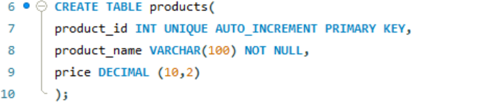
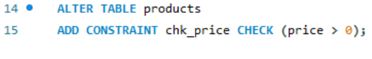
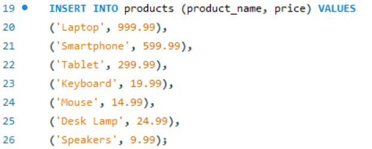
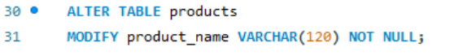

## FINAL TASK 3: TABLE MANIPULATION

For this task, we are given MySQL statements that need to be implemented.

### Here’s the screenshots of Query Statements (See screenshots)

 ### Task 1

### Task 2
  

### Task 3
  

### Task 4
  

