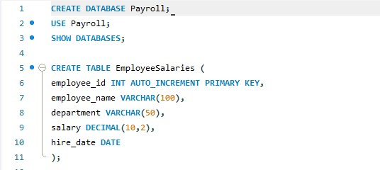
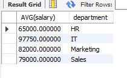
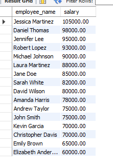
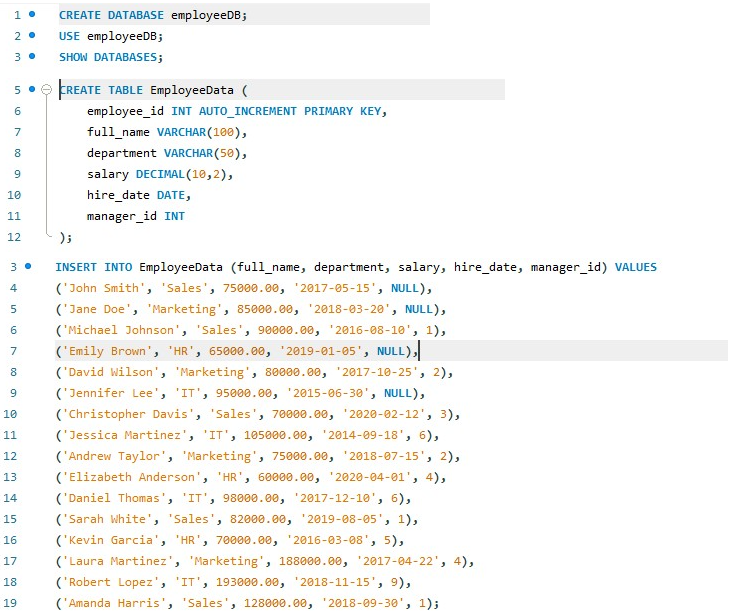

# Final Lab Task 4

## Task Description:

- This task involved working with a single database containing two tables: EmployeeSalaries and EmployeeData. I performed a series of SELECT statements to extract and manipulate employee information.

## Step 1: Query Statements

### Objective: Perform queries on the EmployeeSalaries table.

- Problem 1: Consider a table named EmployeeSalaries that stores information about the salaries of employees.
- The table has the following fields:
  
```sql
CREATE DATABASE payroll;
USE payroll;

CREATE TABLE EmployeeSalaries (
    employee_id INT AUTO_INCREMENT PRIMARY KEY,
    employee_name VARCHAR(100),
    department VARCHAR(50),
    salary DECIMAL(10,2),
    hire_date DATE
);
```


### Retrieve the employee_name and salary and arrange from the highest salary to lowest.

```sql
SELECT employee_name, salary FROM EmployeeSalaries ORDER BY salary DESC;
```


### Retrieve the department names along with the average salary for each department.

```sql
SELECT department, AVG(salary) AS average_salary FROM EmployeeSalaries GROUP BY department;
```


## Step 2: Key Schema Statements

**Objective:** Perform queries on the `EmployeeData` table.

- Problem 2: Create a database named employeeDB and copy and paste the initial query.
- The `EmployeeData` table stores information about employees with the following schema:
  
```sql
CREATE DATABASE employeeDB;
USE employeeDB;

CREATE TABLE EmployeeData (
    employee_id INT AUTO_INCREMENT PRIMARY KEY,
    full_name VARCHAR(100),
    department VARCHAR(50),
    salary DECIMAL(10,2),
    hire_date DATE,
    manager_id INT
);
```

